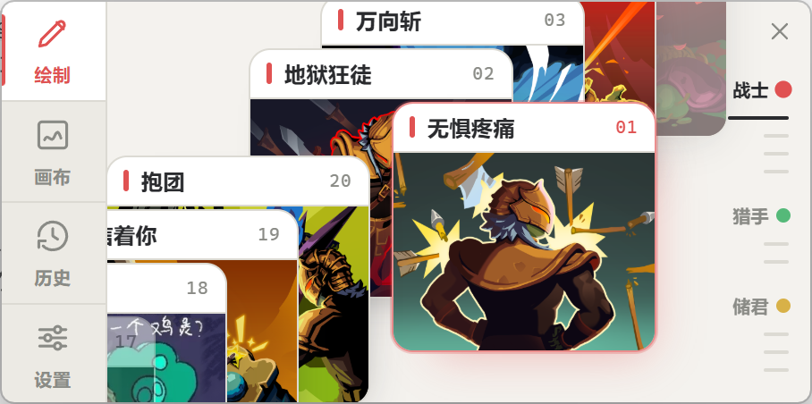
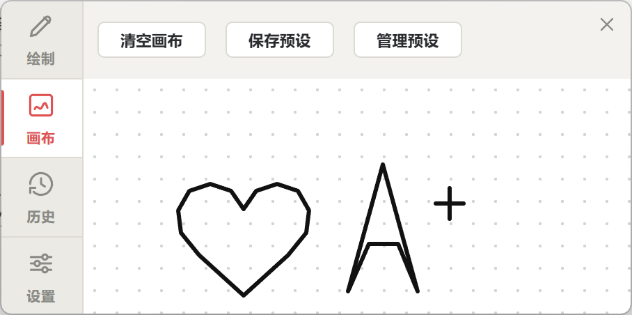
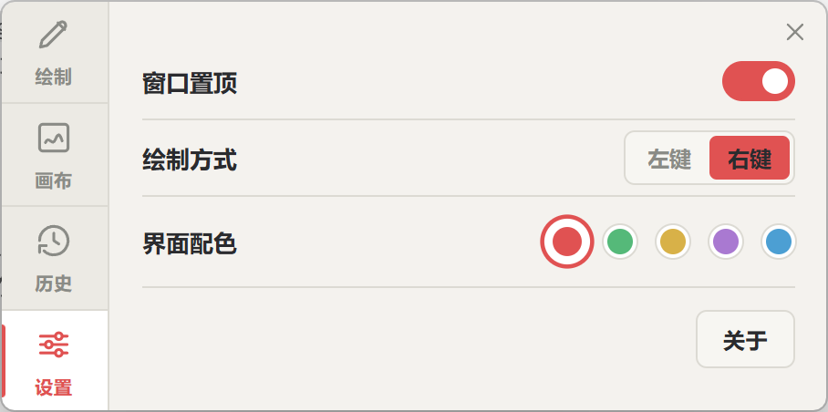

# 🎨 HaiZaiQiDong

> **还在启动** —— 面向《杀戮尖塔 2》游戏画布的 Windows 简笔画自动绘制工具。

**[⬇️ 前往 Releases 下载 Windows x64 完整版](https://github.com/Kumiko-kmk/HaiZaiQiDong/releases/latest)**

当队友还在讨论路线，而你只想在画布上迅速留下一张“这局一定能赢”的涂鸦时，HaiZaiQiDong 可以把准备好的图案转换成平滑的鼠标轨迹：选图、调整位置与方向、落点，程序便会替你完成绘制。



## 🗼 为什么为《杀戮尖塔 2》做这个工具？

[《杀戮尖塔 2》](https://store.steampowered.com/app/2868840/Slay_the_Spire_2/) 是 Mega Crit 推出的 Roguelike 牌组构筑游戏。尖塔在沉寂千年后再次苏醒，玩家可以独自攀登，也可以在最多四人的在线合作模式中组队冒险。游戏保留了熟悉的构筑、遗物与路线抉择，也加入了新老角色和新的尖塔内容。

游戏中的自由画布很适合交流、整活和给队友打气，但手动画复杂图案既慢又难以复现。HaiZaiQiDong 因此把“画什么”和“怎么画”拆开：

- 预设负责保存图案；
- 悬浮预览负责决定大小、角度与落点，并跟随当前界面配色；
- 绘制控制器把曲线连续转换为 Windows 鼠标输入；
- 任何时候都能用物理鼠标右键取消。

本项目不会读取存档、识别屏幕、连接游戏网络或向游戏进程注入代码。它只是一个通用的 Windows 鼠标矢量绘图器，《杀戮尖塔 2》的画布是它目前主要服务的使用场景。

> 本项目是非官方的玩家工具，与 Mega Crit 或《杀戮尖塔 2》的发行方没有隶属关系。游戏名称、角色及相关素材的权利归其各自权利人所有。

## ✨ 功能一览

- **20 个内置主题预设**：按战士、猎手、储君、骨妹、鸡煲及其他标签分组展示。
- **卡牌式预设轮盘**：滚轮、方向键或鼠标点击即可切换，右侧色带可以快速跳转。
- **所见即所得的落点预览**：在真正绘制前用键盘缩放、旋转并确认落点。
- **平滑流式绘制**：以固定像素间距采样曲线，并以稳定速度发送鼠标输入。
- **自定义画布**：直接手绘新图案，保存后立即出现在预设库中，支持改名与删除。
- **JSON / SVG 导入**：便于制作、交换和维护更多矢量图案。
- **绘制历史**：记录成功、取消、失败、耗时、事件数、缩放和使用的鼠标键。
- **多显示器与高 DPI 支持**：按 Windows 虚拟桌面坐标发送输入，适配常见缩放比例。
- **安全取消机制**：绘制时物理右键始终优先用于终止，程序自己注入的右键不会误触取消。
- **自动请求管理员权限**：启动时显示 Windows UAC 提示，确保可以控制以管理员身份运行的游戏。

## 🚀 三分钟上手

### 📦 使用打包版

1. 从 [GitHub Releases](https://github.com/Kumiko-kmk/HaiZaiQiDong/releases/latest) 下载最新版 ZIP，并完整解压 `HaiZaiQiDong` 文件夹。
2. 双击 `HaiZaiQiDong.exe`，并在 Windows UAC 提示中选择“是”。
3. 打开《杀戮尖塔 2》并进入需要绘图的画布。
4. 回到工具，在“绘制”页选择一个预设，点击最前方卡片进入就绪状态。
5. 把半透明预览移动到游戏画布，用 `W` / `S` 调整大小、`A` / `D` 调整方向，单击鼠标左键落点；不想绘制时按右键取消。
6. 等待轨迹完成；若需要紧急停止，按下物理鼠标右键。

> 请分发和移动**整个** `dist\HaiZaiQiDong` 文件夹，不要只复制其中的 EXE。网页界面、预设数据和运行库都在同一目录中。

### 🧰 从源码运行

环境要求：Windows 10/11、Python 3.9–3.12（推荐 3.12）。

最省事的方式是双击根目录中的：

```text
run.bat
```

它会检查 `.venv`；环境不存在或损坏时，会自动调用安装脚本重新创建。程序随后会请求管理员权限并以提升后的进程继续启动。

也可以在 PowerShell 中执行：

```powershell
Set-ExecutionPolicy -Scope Process Bypass
.\scripts\setup.ps1
.\scripts\run.ps1
```

或像在 IDE 中一样直接运行：

```powershell
.\.venv\Scripts\python.exe main.py
```

## 🃏 绘制页：从卡牌到画布


### 1️⃣ 选择阶段

| 操作 | 效果 |
| --- | --- |
| 鼠标滚轮 / `↑` `↓` | 在预设卡片间前后切换 |
| 点击后方卡片 | 将该卡片带到最前面 |
| 点击最前方卡片 | 确认预设并进入“就绪”状态 |
| 点击右侧角色色带 | 快速跳到对应位置的预设 |

### 2️⃣ 就绪阶段

此时预设会成为跟随鼠标的半透明悬浮图。先调整，再落点：

| 操作 | 效果 |
| --- | --- |
| `W` / `S` | 在 `0.5×` 到 `2.0×` 之间放大 / 缩小 |
| `A` / `D` | 每次逆时针 / 顺时针旋转 `5°`，按住可连续调整 |
| 单击并松开左键 | 以当前鼠标位置作为中心，开始绘制 |
| 单击右键 | 取消当前预览并回到预设选择状态 |

悬浮预览的线条颜色会跟随“设置”页选择的界面配色变化。

### 3️⃣ 绘制阶段

程序按照预设中的线段顺序移动鼠标，并持续按住“设置”页选择的绘制键。内部默认速度为约 `720 px/s`，采样间距约为 `3 px`，发送频率上限为 `240 Hz`。这些参数保持固定，以减少不同电脑上因过度调速产生的断线或抖动。

绘制期间请尽量不要主动移动鼠标。需要中止时，按下**物理鼠标右键**；程序会释放按键并回到预设选择状态。

## 🖼️ 内置预设

当前版本随包提供 20 个预设。下表中的分组名采用程序界面的简短标签：

| 分组 | 预设 |
| --- | --- |
| 战士 | 无惧疼痛、地狱狂徒、万向斩、耸肩无视 |
| 猎手 | 华丽收场、蛇咬 |
| 储君 | 护驾、征召上前、淬炼刀刃、胜券在王 |
| 骨妹 | 保护者、灵魂风暴 |
| 鸡煲 | 冷静头脑、冰雹风暴、迭代、同步、小红严父、抗压 |
| 其他 | 相信着你、抱团 |

首次启动以及每次新版启动时，程序都会把随包内置预设同步到用户数据目录；新版可以覆盖旧版内置内容并移除已经退役的内置项。你自己保存的预设位于独立目录，不会被这一过程删除。

## ✍️ 画布页：把自己的梗保存下来



画布页提供一块 `720 × 360` 的白色手绘区域。按住鼠标左键即可连续画线，程序会利用浏览器提供的合并指针事件保留快速移动时的中间点。

- **画笔 / 橡皮擦**：使用画布左侧工具切换绘制和局部擦除状态。
- **撤回 / 前进**：逐步撤销或恢复最近的手绘、擦除及 SVG 载入操作；开始新的编辑后，旧的前进记录会自动清除。
- **垃圾桶**：彻底清空当前草稿及撤回、前进记录，从头开始。
- **上传 SVG**：选择本机 SVG 轮廓图，将矢量路径载入画布预览；明确使用纯色填充表示粗线的 SVG 会自动提取笔画中心线，避免导入成双层空心轮廓。
- **保存预设**：填写名称，将当前笔迹转换为自定义预设并生成缩略图。
- **管理预设**：查看自定义项，可点击“更改”将原图案载入画布；修改后再次保存会直接更新原预设，也可在此改名或删除。没有自定义预设时按钮会禁用。

保存完成后，新图案会立即出现在“绘制”页的预设轮盘中，不必重启程序。为了得到更好的自动绘制效果，建议一笔完成连续轮廓，减少极短、反复覆盖的线段。

## 🕘 历史页：知道刚才发生了什么

历史页显示最近 200 条绘制记录，并支持手动刷新。每条记录会保留：

- 预设名称、时间和结果状态；
- 绘制耗时、发送的鼠标事件数量；
- 当时的缩放比例和绘制键；
- 取消原因或异常信息（如果存在）。

它适合判断“图案太复杂导致耗时较长”，也方便分辨操作取消、权限限制和实际绘制失败。

## ⚙️ 设置页



| 选项 | 默认值 | 说明 |
| --- | --- | --- |
| 窗口置顶 | 开启 | 让工具面板尽量保持在游戏窗口上方，便于选图。关闭后可像普通窗口一样切换层级。 |
| 绘制方式 | 右键 | 选择实际画线时持续按住左键还是右键。这里改变的是发送给目标画布的画线按键；确认落点仍使用左键。 |
| 界面配色 | 战士红 | 可选战士红、静默猎手绿、储君黄、灵魂契约师紫、故障机器人蓝。配色选择会保存在内嵌浏览器的本地存储中。 |
| 关于 | — | 查看程序用途和基础操作提示。 |

“窗口置顶”和“绘制方式”每次启动回到默认值；界面配色会记住上一次选择。

## 🧩 自定义预设格式

自定义和内置预设都使用 JSON 描述矢量线段。最小示例：

```json
{
  "id": "my_first_preset",
  "name": "我的第一个预设",
  "description": "一条用于测试的直线",
  "tags": ["其他", "自定义"],
  "drawButton": "right",
  "version": 1,
  "strokes": [
    {
      "segments": [
        { "type": "move", "to": [-120, 0] },
        { "type": "line", "to": [120, 0] }
      ]
    }
  ]
}
```

支持的线段类型包括：

- `move`：移动到新起点，不绘制；
- `line`：直线；
- `arc`：圆弧；
- `cubicBezier`：三次贝塞尔曲线；
- `quadraticBezier`：二次贝塞尔曲线；
- `ellipse`：椭圆；
- `polyline`：折线。

后端还提供 JSON 与常见 SVG 图元的导入能力，包括 `path`、`line`、`polyline`、`circle` 和 `rect`。若要批量制作预设，可参考 `presets/data` 中的现有文件和 `tools` 目录中的轨迹辅助工具。

## 💾 数据保存位置

运行时数据位于：

```text
%APPDATA%\HaiZaiQiDong\
├─ presets\
│  ├─ data\          # 随版本同步的内置预设镜像
│  ├─ custom\        # 用户自定义预设
│  └─ _previews\     # 自定义缩略图
└─ logs\
   └─ drawing-history.jsonl
```

升级或覆盖程序前，通常无需迁移这些数据；新版本首次启动时会自动复制旧 `%APPDATA%\MouseSketchDrawer` 目录中的预设和历史。若要备份自己的作品，复制 `presets\custom` 和 `_previews` 即可。

## 🏗️ 项目结构与工作方式

```text
main.py                      # 程序入口
gui/                         # 应用服务、Web API、悬浮预览
core/                        # 状态机、绘制控制、输入、历史与坐标变换
presets/                     # 预设模型、注册表、导入器与内置数据
web/                         # pywebview 前端界面和预设缩略图
tools/                       # 轨迹采集/转换辅助工具
tests/                       # 自动化测试
scripts/setup.ps1            # 创建/修复开发环境
scripts/run.ps1              # 启动源码版
scripts/build.ps1            # 构建 Windows onedir 发布包
HaiZaiQiDong.spec            # PyInstaller 打包配置
```

一次绘制请求大致经过以下链路：

```text
Web 界面
  → WebApi
  → AppService 状态机
  → DrawController
  → 曲线采样与坐标变换
  → Windows SendInput
  → 游戏画布
```

程序状态按 `IDLE → READY → DRAWING → IDLE` 流转；取消时会短暂进入 `TERMINATING`，确保已按下的鼠标键得到释放。

## 🧪 开发、测试与打包

安装开发依赖后，可按范围运行单元测试、跨模块集成测试或完整回归：

```powershell
.\.venv\Scripts\python.exe -m tests.run unit
.\.venv\Scripts\python.exe -m tests.run integration
.\.venv\Scripts\python.exe -m tests.run
```

测试分层、公共夹具和新增场景的约定见 [`tests/README.md`](tests/README.md)。

构建 Windows 发布包：

```powershell
.\scripts\build.ps1
```

产物位于：

```text
dist\HaiZaiQiDong\HaiZaiQiDong.exe
```

PyInstaller 配置会同时收集网页界面、所有内置预设、`pynput` 的 Windows 后端，以及需要时的 Tcl/Tk 运行文件。项目使用 `onedir` 形式，便于检查资源是否齐全，也能避免单文件程序每次启动时重复解压大量资源。

## 🩹 常见问题

### 点击落点后没有绘制

如果《杀戮尖塔 2》以管理员身份运行，普通权限的工具可能被 Windows 的输入权限隔离。请退出工具，再以相同的管理员权限启动。反过来也建议让游戏和工具保持同一权限级别。

### Windows SmartScreen 或杀毒软件提示未知程序

未签名的个人 PyInstaller 程序可能触发信誉提示。请从本项目发布页下载、核对来源，并按自己的安全策略决定是否允许运行；源码和构建脚本均可供检查与自行构建。

### 双击 EXE 后界面空白或无法打开

确认复制的是完整发布文件夹，并检查系统是否安装了 Microsoft Edge WebView2 Runtime。Windows 10/11 的常规更新版本通常已经包含它。

### 图案偏离目标区域

先在就绪预览中确认中心、缩放和旋转，再单击左键。跨显示器使用时，如果两块屏幕的缩放比例差异很大，可以先把游戏与工具移动到同一块屏幕进行验证。

### 如何立即停止正在画的图？

按物理鼠标右键。即使“绘制方式”也选择了右键，程序仍会区分真实按键和自身注入事件，优先执行安全取消。

---

如果你制作了新的预设，欢迎保留清晰的名称、合理的画布尺寸和简洁的线段顺序——尖塔会重组，但一张好梗图值得重复使用。
